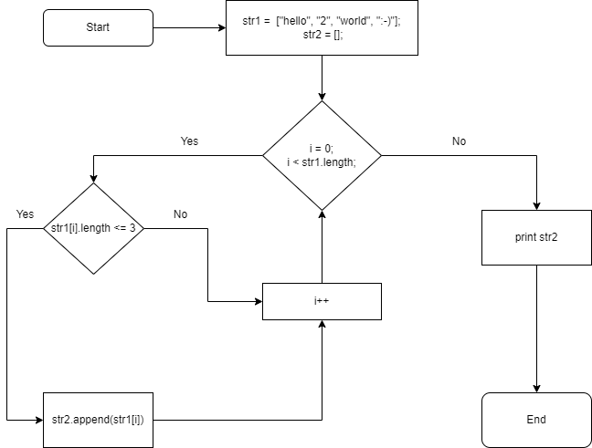

# Итоговая проверочная работа
**Написать программу, которая из имеющегося массива строк формирует массив из строк, длинна которых меньше либо равна 3 символа**
* Создал открытый репозиторий на GitHub

* Перешел к написанию кода:
1. Добавил 2 массива (первый заполнен, второй пустой)
2. Добавил цикл для проверки каждого элемента первого массива
3. Добавил условие для заполнения второго массива
4. Проверил на работоспособность и вывод результата
